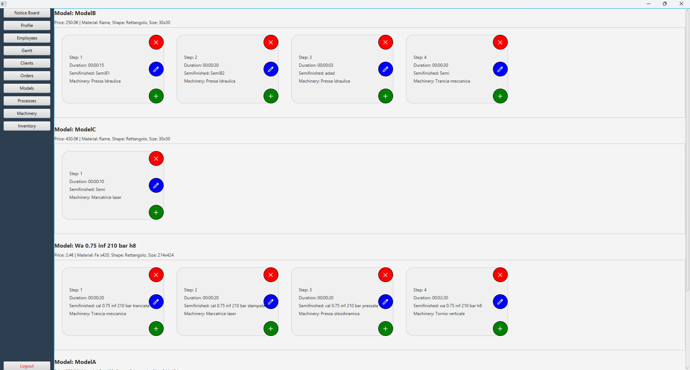

---

# 💡 Process Manager Project:

L'applicativo è stato creato come stumento in grado di aiutare nella gestione dei principali aspetti dell'attività produttiva e organizzativa, permettendo di:
- Gestire ordini, modelli e processi.
- Pianificare e monitorare le lavorazioni.
- Organizzare le risorse aziendali, come macchinari, materie prime e personale.
- Gestire i clienti.
- Pubblicare annunci per comunicazioni interne.

Una descrizione più dettagliata può esser vista dalla [documentazione](Documentazione%20tesi.pdf).

---

# Screenshots:
Di seguito riporto degli screenshot esemplificativi dell'applicazione in funzione.

---
